# Ball & Beam — kamera geri beslemeli denge sistemi

Bir pinpon topu 45 cm'lik bir ray üzerinde duruyor. Rayın bir ucu sabit mafsalda,
diğer ucu bir krank–biyel mekanizmasıyla step motora bağlı. Topun nerede olduğunu
**kamera** söylüyor, rayı ne kadar eğeceğini **ESP32-S3 üzerinde 250 Hz'de koşan
bir PID** hesaplıyor. Hedef konumu kullanıcı arayüzden giriyor; sistem topu oraya
götürüp orada tutuyor, dışarıdan itilse bile geri getiriyor.

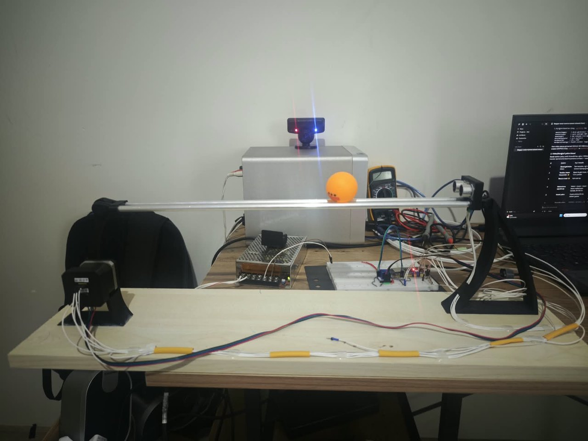

## Çalışırken

Solda gerçek düzenek, sağda aynı anın arayüzdeki karşılığı — ikisi de aynı saniyeler:

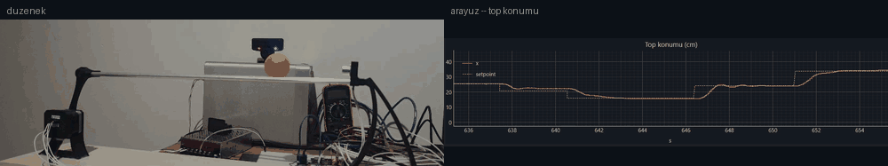

| | |
|---|---|
| **Bozucu etki:** topa elle vuruluyor, kontrolcü ~1 s içinde hedefe geri getiriyor | **Hedef değişimi:** arayüzden yeni konum giriliyor |
| 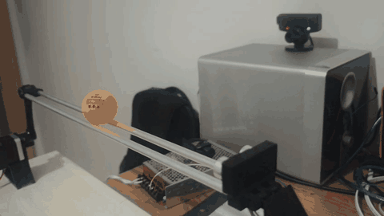 | 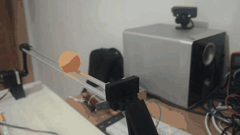 |

## Ölçülen başarım

Hepsi bu düzenekte, ±5 cm'lik adımlarla ölçüldü (ayrıntı: [K-028](docs/decision_log.md)).

| | |
|---|---|
| Adım cevabı aşımı | **%1,9** ortalama |
| Oturma süresi | **~1,5 s** |
| Kalıcı konum hatası | **+0,14 cm** |
| Denetim çevrimi | 4 ms (250 Hz), bütçe **314 µs ortalama / 467 µs tepe** |
| Kamera | 320×240 @ **100 fps**, konum gürültüsü 0,28 mm |
| Uçtan uca gecikme | **45 ms** (kamera + USB + çevrim) |
| Telemetri | 125 Hz ikili çerçeve, gidiş-dönüş 1–2 ms |
| Beam açısı aralığı | ±3,13° (mekanizma tepe noktasının %4 altında) |

Kalan dağılımın kaynağı kontrolcü değil mekanik: topun ray üzerindeki ölü bandı
0,15–0,3°, yani ±0,2–0,5 cm'lik bir konum belirsizliği. Tek tek adımlarda aşım
%−9 ile %+16 arasında geziniyor, ortalama %2'de kalıyor.

## Nasıl çalışıyor

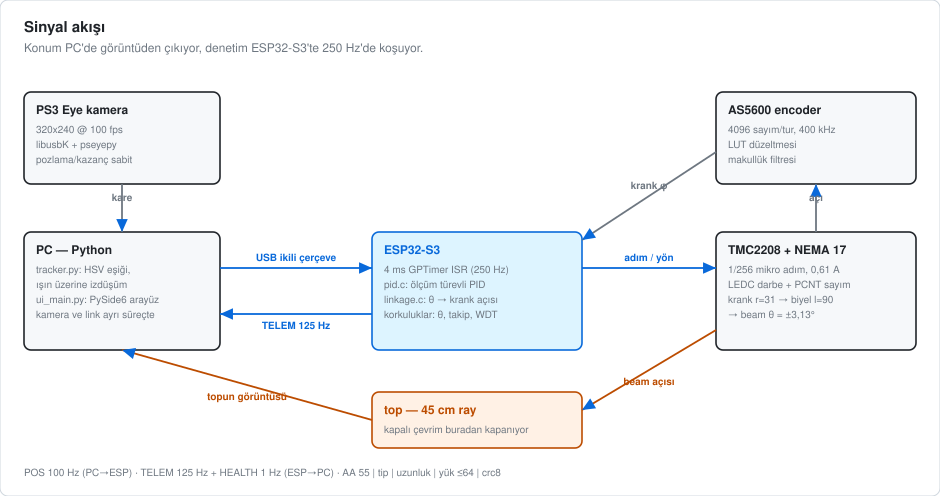

**Konum ölçümü PC'de.** PS3 Eye kamerası 100 fps'te kare veriyor; `tracker.py`
turuncu topu HSV eşiğiyle buluyor ve kalibrasyonda tanımlanan ray ekseni üzerine
izdüşürüyor. Sonuç santimetre cinsinden tek bir sayı olarak USB üzerinden karta
gidiyor.

**Denetim ESP32-S3'te.** 4 ms'lik bir donanım zamanlayıcısı denetim görevini
uyandırıyor. Ölçüm türevli, türev filtreli, koşullu tümlevli bir PID topun
konum hatasından **beam açısı** üretiyor; `linkage.c` bu açıyı tam kinematikle
krank açısına çeviriyor; step sürücü krankı oraya götürüyor. Denetim yolunda tek
bir `printf` yok — bir satır bile milisaniyeler götürüyor.

Krankın beam'i nasıl sürdüğü:

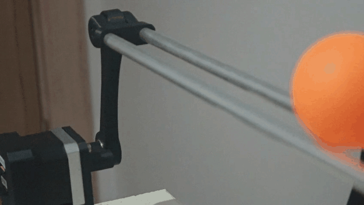

**Mekanizma doğrusal değil.** Krank açısı φ ile beam açısı θ arasındaki ilişki
φ = 75,5°'de +3,265° ile tepe yapıp geri dönüyor. Komut bu tepenin %4 altında,
±3,13°'de sınırlanıyor; mekanizma tekilliğe hiç girmiyor.

| Bağlama geometrisi | θ(φ) karakteristiği |
|---|---|
| 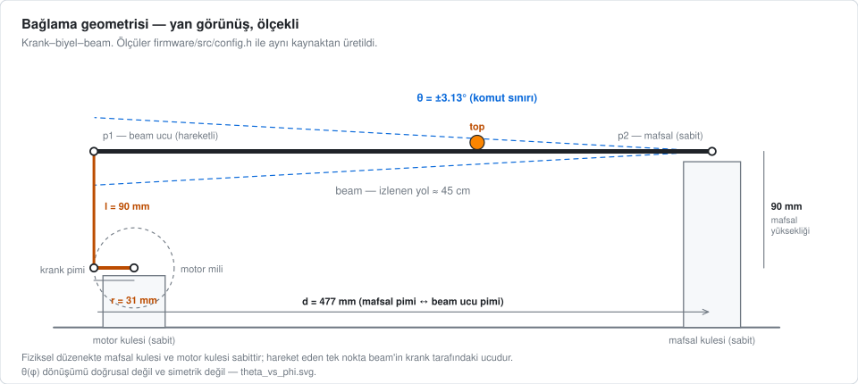 | 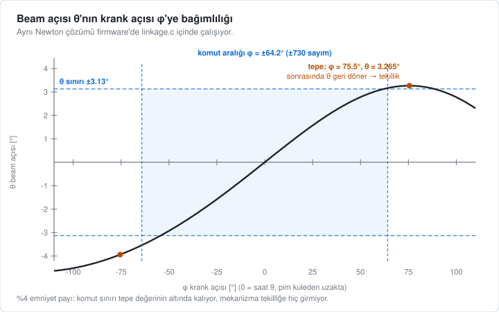 |

**Korkuluklar.** Beam açısı ve krank komutu sınırlı; encoder makullük filtresinden
geçiyor; takip hatası büyürse sistem FAULT'a düşüyor; konum verisi bayatlarsa beam
kendiliğinden yataylanıyor; görev besleme zamanlayıcısı (WDT) panik modunda.
Kablo çekilse, 12 V kesilse, kamera sökülse sistem güvenli tarafa düşüyor ve
donanım geri geldiğinde kendi kendine toparlanıyor.

## Donanım

| | |
|---|---|
| ESP32-S3 + TMC2208 | AS5600 encoder |
| 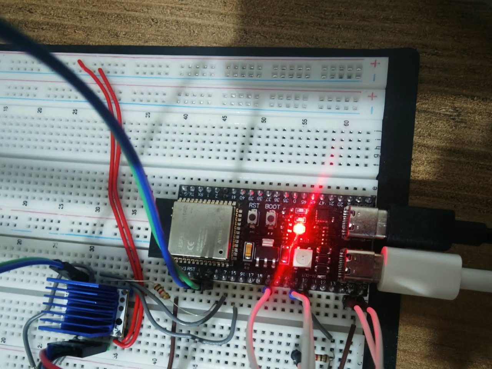 | 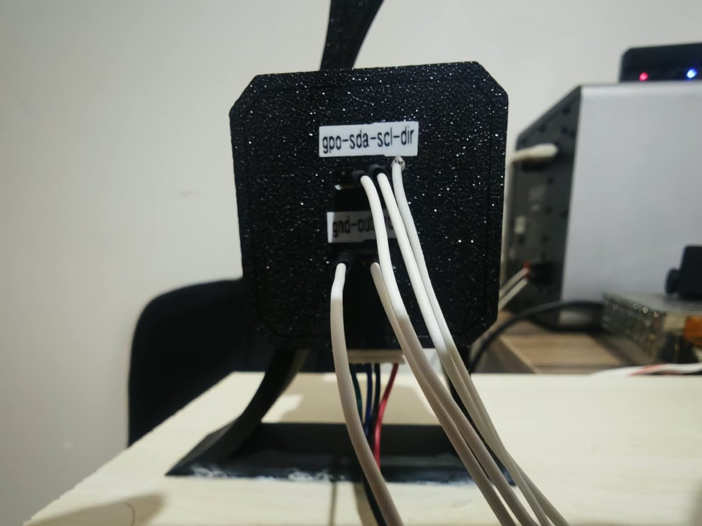 |
| TMC2208 (soğutuculu) | PS3 Eye kamera |
| 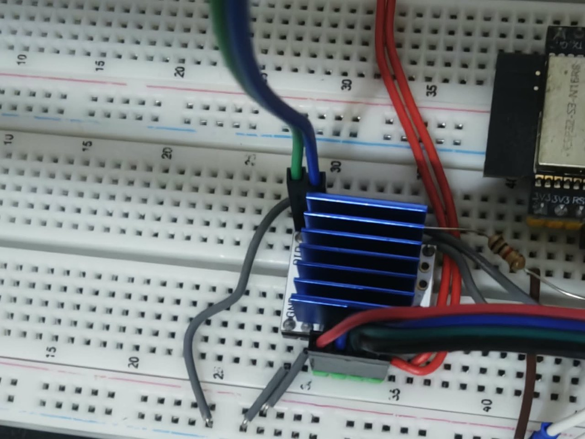 | 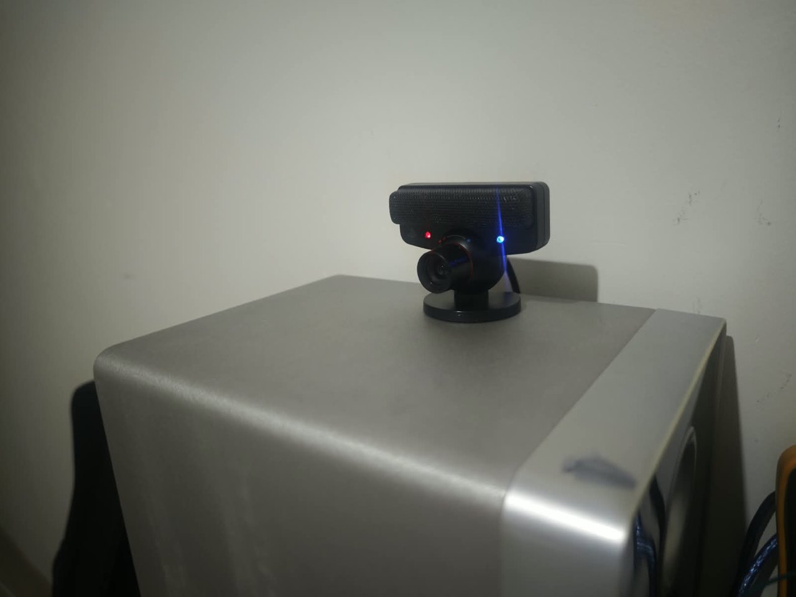 |

Bağlantılar:

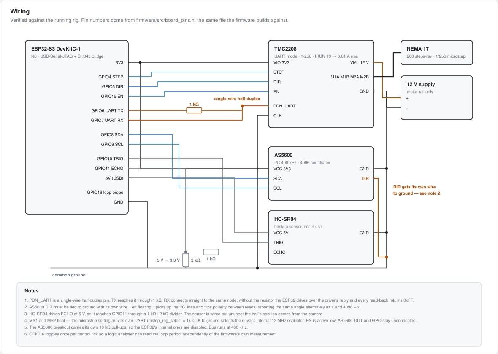

Parça listesi, **doğrulanmış pin haritası**, kablolamadaki tuzaklar (AS5600'ün DIR
pini mutlaka GND'ye, TMC UART TX'ine 1 kΩ, ortak toprak…), bağlama ölçüleri ve
kamera sürücüsünün kurulumu: **[hardware/README.md](hardware/README.md)**

Veri sayfaları ve hangi bölümlerinin işe yaradığı:
[docs/datasheets/](docs/datasheets/README.md)

## Arayüz

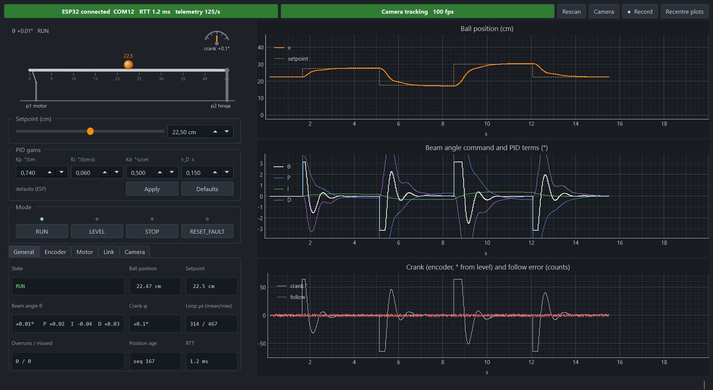

Solda düzeneğin şeması (beam gerçek açısıyla eğiliyor, turuncu top ölçülen konum,
içi boş halka hedef), sağda üç canlı grafik: top konumu, beam açısı ile PID
terimleri, krank açısı ile takip hatası. Altta mod düğmeleri ve sekmeli sağlık
paneli.

| Kamera görünümü — şemanın yerine geçiyor | Sağlık paneli |
|---|---|
| 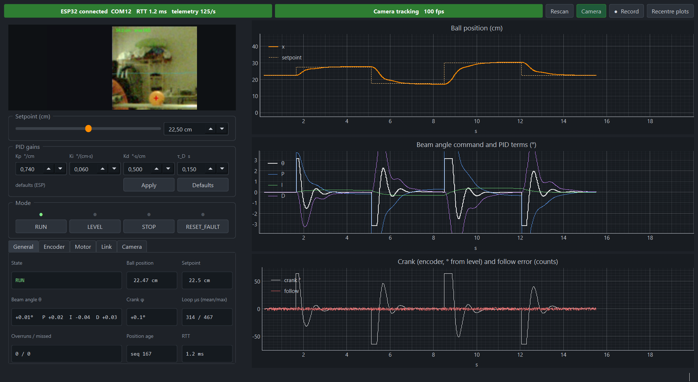 | 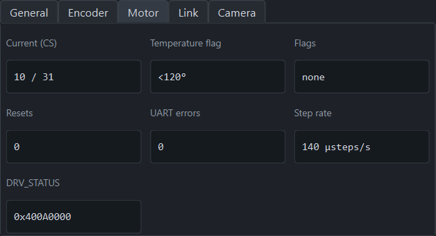 |

Kamera görünümü açıkken takip canlı izlenebiliyor:

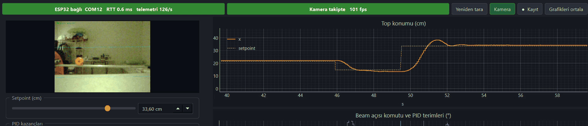

**Cihaz kaybına dayanıklılık.** Arayüz kamera veya kart takılı değilken de açılıyor,
uyarıyor ve beklemeye geçiyor; çalışırken bir cihaz çekilirse donmuyor, cihaz geri
takıldığında kendiliğinden bağlanıyor. (Kamera ayrı bir süreçte koşuyor: `pseyepy`
kare okurken GIL'i bırakmıyor, bu yüzden iş parçacığı yetmedi.)

| ESP32 çekildi → geri takıldı | Kamera çekildi → geri takıldı |
|---|---|
| 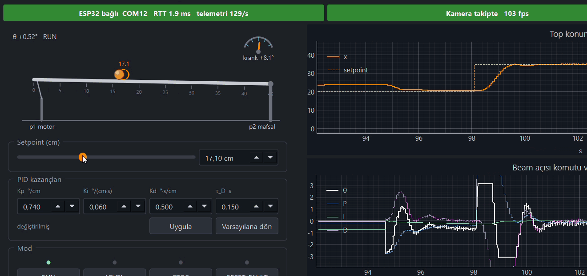 | 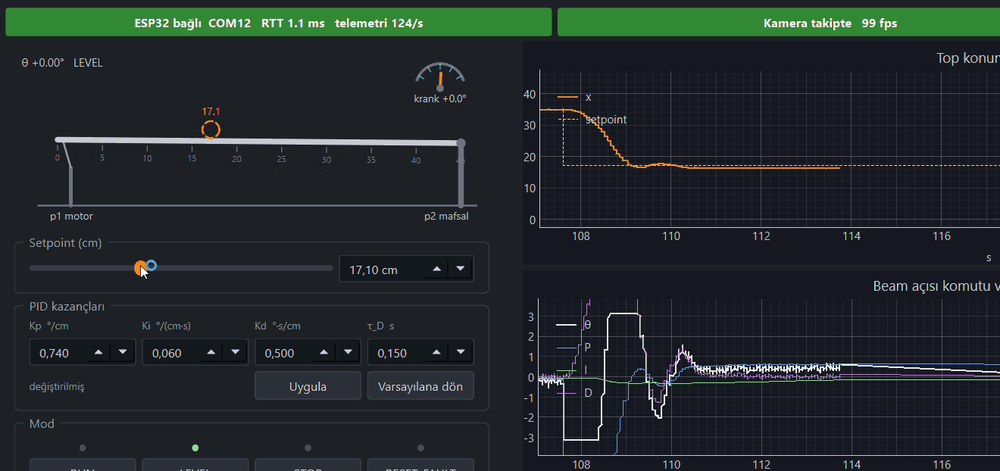 |

## Kurulum

### 1. Firmware

[PlatformIO](https://platformio.org/) ve ESP-IDF gerekiyor.

```bash
cd bb_esp32s3
pio run -e esp32-s3-devkitc-1 -t upload
```

Kart iki seri port gösteriyor: **COM11** (CH343 köprüsü) konsol ve yükleme için,
**COM12** (yerleşik USB-Serial-JTAG) PC bağlantısı için. Faz 1 getirme testleri
ayrı bir ortamda: `pio run -e tests -t upload`.

### 2. PC tarafı

```bash
python -m venv .venv
.venv\Scripts\activate
pip install -r gui/requirements.txt
```

`pseyepy` PyPI'da yok, GitHub'dan C uzantısı derleniyor — MSVC Build Tools gerekli.

### 3. Kamera sürücüsü (bir kez)

PS3 Eye'ın DirectShow sürücüsü çözünürlük isteğini yok sayıyor ve pozlamaya
erişemiyor. `tools/zadig-2.9.exe` ile **yalnızca Interface 0**'a `libusbK`
kurulmalı — mikrofon arayüzüne (MI_01) dokunulmamalı. Adımlar:
[hardware/README.md](hardware/README.md#ps3-eye-sürücüsü-windows)

### 4. Kalibrasyon ve çalıştırma

```bash
python gui/app.py
```

Açılışta kayıtlı kalibrasyonla devam edebilir ya da sihirbazı çalıştırabilirsin;
sihirbaz ray eksenini (iki uç noktası), topun HSV eşiğini ve pozlama/kazancı
belirleyip `gui/calibration.json` dosyasına yazıyor. Sonra **RUN**, ve hedef konumu
gir.

| Mod | Ne yapar |
|---|---|
| `RUN` | Kapalı çevrim denetim |
| `LEVEL` | Beam yatayda tutulur, PID durur |
| `STOP` | Darbeler kesilir, sürücü serbest |
| `RESET_FAULT` | Hatayı temizler, sürücüyü yeniden kurar ve devreye alır |

## Ayar

Firmware'in derlenmiş varsayılanları (`bb_esp32s3/src/config.h`):

| Kp | Ki | Kd | τ_D |
|---|---|---|---|
| 0,74 °/cm | 0,06 °/(cm·s) | 0,50 °·s/cm | 0,15 s |

Arayüzden canlı değiştirilebilir, **Defaults** düğmesiyle geri alınır. Kazançları
kendi düzeneğinde yeniden bulacaksan:

* Aşımın kaynağı çoğunlukla **sönüm**: ζ = Kd·K° / (2·√(Kp·K°)). Bu düzenekte
  Kd 0,34 → 0,50 değişikliği ζ'yı 0,64'ten 0,94'e çıkarıp ortalama aşımı
  %17'den %2'ye indirdi.
* Kp'yi ~0,85'in üstüne çıkarmak 45 ms'lik çevrim gecikmesine tosluyor ve aşım
  geri geliyor.
* Ki yalnızca topu kendi ölü bandından sürünerek geçirmeye yarıyor; büyütmek
  ölçülebilir bir şey kazandırmıyor.
* **Ölçüm tuzağı:** oturma bandını 0,3 cm gibi dar seçersen adımların yarısı
  "oturmadı" sayılır. Tesisin kendi kalıcı hatası 0,2–0,5 cm; band ≥ 0,5 cm olmalı.

Tesis tanımlama betiği (tezgâh kullanımı, arayüze bağlı değil):
`python gui/tools_run_autotune.py`

## Depo düzeni

```
bb_esp32s3/        ESP32-S3 firmware (PlatformIO + ESP-IDF)
  src/             denetim görevi, PID, kinematik, sürücüler, protokol
gui/               PySide6 arayüz, kamera takibi, USB bağlantısı
docs/
  decision_log.md  projeyi şekillendiren kararlar ve ölçümler (K-001…K-028)
  datasheets/      veri sayfaları + hangi bölüm ne işe yarıyor
hardware/          pin haritası, kablolama, ölçülü çizimler, 3D parçalar
assets/            README'nin kullandığı görseller ve GIF'ler
tools/             çizim ve medya üreticileri, Zadig
```

`history/firmware` ve `history/gui` dalları, tek depoda birleşmeden önceki
geliştirme geçmişini (faz faz) taşıyor.

## Karar günlüğü

[`docs/decision_log.md`](docs/decision_log.md) bu projenin asıl belgesi: her
kararın tarihi, gerekçesi, ölçümü ve reddedilen alternatifleri yazılı. Örnekler:

* **K-013** — Konum sensörü olarak HC-SR04 yerine kamera; ultrason neden yanıldı.
* **K-018** — AS5600'ün DIR pini boşta kalınca aynı açıyı neden dönüşümlü olarak
  x ve 4096−x bildiriyor.
* **K-022 / K-025** — Denetim yolunda log yasağı: encoder çekildiğinde I²C
  sürücüsünün ürettiği log seli çevrimi 4 ms'den 14,5 ms'ye çıkardı.
* **K-024** — Küçük açı yaklaşımı yerine tam kinematik; mekanizmanın asimetrisi.
* **K-027** — Otomatik ayar yazıldı, ölçüldü, elle bulunan kazançlardan kötü
  çıktığı için **reddedildi**.
* **K-028** — Son kazançlar ve aşımın gerçek kaynağı.

## Lisans

Kod, belgeler ve çizimler [MIT](LICENSE).

Basılı parçaların modelleri bu projeye ait değil ve burada yeniden
yayımlanmıyor — kaynağından indirilebilir:
[IVProjects/Engineering_Projects](https://github.com/IVProjects/Engineering_Projects/tree/main/ProjectFiles/Ball%20and%20Beam%20Control%20System).
Hangi parçaların gerektiği ve yazılımın beklediği ölçüler
[hardware/3d/](hardware/3d/) içinde.

---

## English summary

A ping-pong ball balances on a 45 cm rail. One end is hinged, the other is driven
by a crank-and-rod linkage on a NEMA 17 stepper. A PS3 Eye camera at 100 fps
measures the ball's position on the PC; an ESP32-S3 closes a 250 Hz PID loop over
a binary USB link and tilts the beam through the linkage, with an AS5600 encoder
on the crank shaft.

Measured on the rig: **1.9 % average step overshoot, ~1.5 s settling, +0.14 cm
residual error**, 45 ms end-to-end delay, 314 µs average loop budget out of 4 ms.
The remaining spread is mechanical — the ball's own stiction is worth ±0.2–0.5 cm.

The full engineering narrative (every decision, its measurement, and the
alternatives that were rejected) is in `docs/decision_log.md`, in Turkish.
